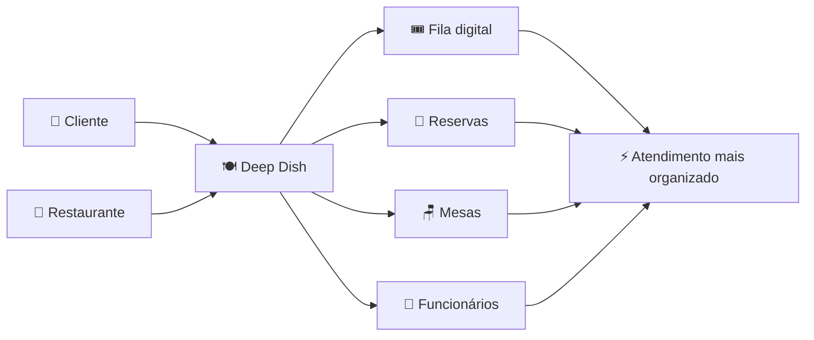
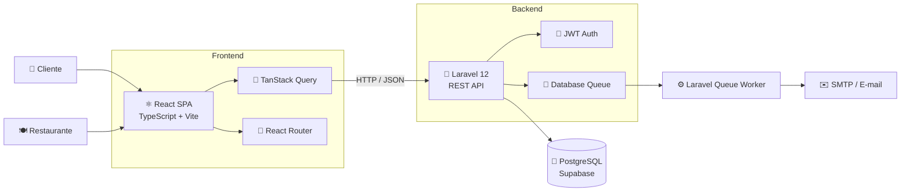
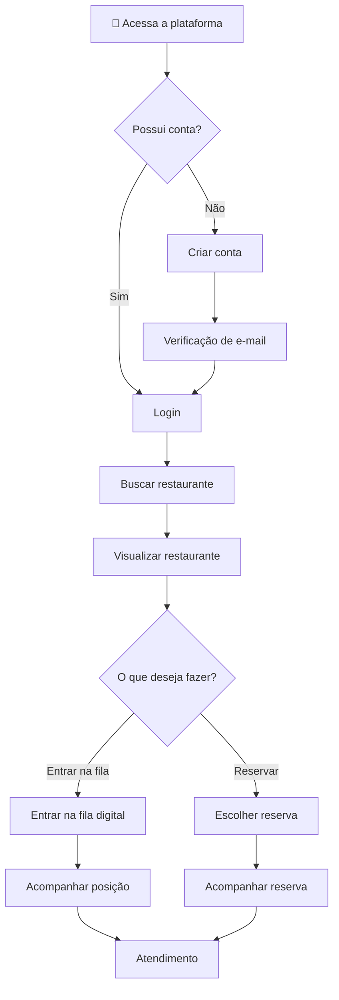
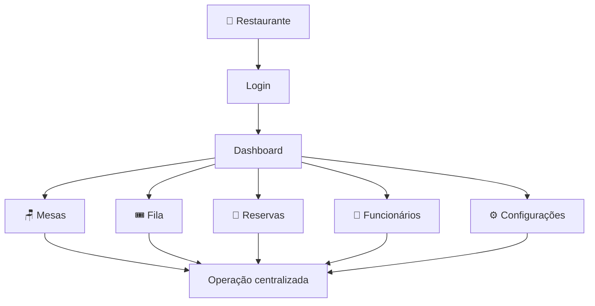
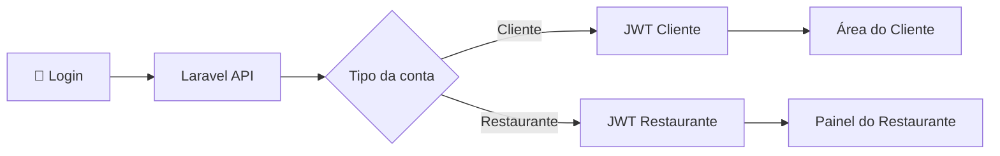
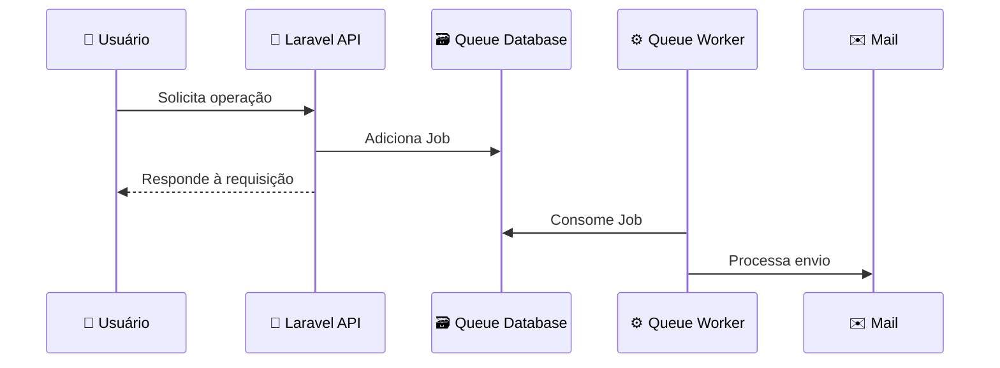
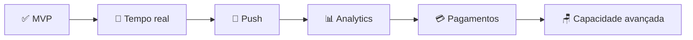
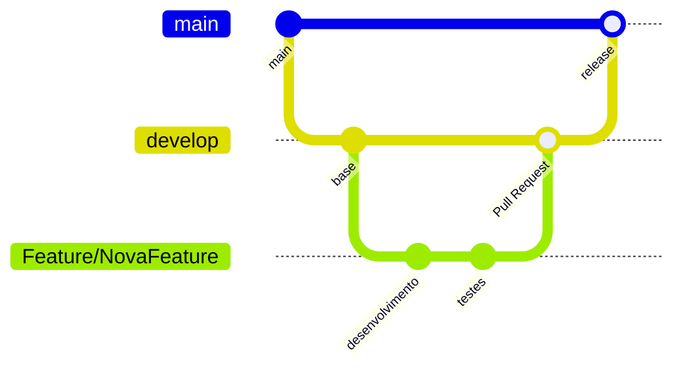

<div align="center">

```text
██████╗ ███████╗███████╗██████╗     ██████╗ ██╗███████╗██╗  ██╗
██╔══██╗██╔════╝██╔════╝██╔══██╗    ██╔══██╗██║██╔════╝██║  ██║
██║  ██║█████╗  █████╗  ██████╔╝    ██║  ██║██║███████╗███████║
██║  ██║██╔══╝  ██╔══╝  ██╔═══╝     ██║  ██║██║╚════██║██╔══██║
██████╔╝███████╗███████╗██║         ██████╔╝██║███████║██║  ██║
╚═════╝ ╚══════╝╚══════╝╚═╝         ╚═════╝ ╚═╝╚══════╝╚═╝  ╚═╝
```

### Fila inteligente. Reservas sem fricção. Restaurantes no controle.

Plataforma web para gerenciamento de **filas, reservas e operação de mesas em restaurantes**.

<br>

[](https://react.dev/)
[](https://www.typescriptlang.org/)
[](https://vite.dev/)
[](https://tailwindcss.com/)
[](https://laravel.com/)
[](https://www.postgresql.org/)
[](https://www.docker.com/)

<br>

[](https://github.com/joaogpereira/deep-dish/commits/main)
[](https://github.com/joaogpereira/deep-dish/issues)
[](https://github.com/joaogpereira/deep-dish/pulls)
[](https://github.com/joaogpereira/deep-dish/stargazers)
[](https://github.com/joaogpereira/deep-dish)

</div>

---

## 📑 Sumário

- [Sobre o projeto](#-sobre-o-projeto)
- [Problema e solução](#-problema-e-solução)
- [Funcionalidades](#-funcionalidades)
- [Arquitetura](#️-arquitetura)
- [Fluxo da aplicação](#-fluxo-da-aplicação)
- [Stack tecnológica](#️-stack-tecnológica)
- [Estrutura do projeto](#️-estrutura-do-projeto)
- [Executando localmente](#-executando-localmente)
- [Variáveis de ambiente](#-variáveis-de-ambiente)
- [Autenticação e controle de acesso](#-autenticação-e-controle-de-acesso)
- [Processamento assíncrono](#️-processamento-assíncrono)
- [Testes e qualidade](#-testes-e-qualidade)
- [Roadmap](#️-roadmap)
- [Contribuindo](#-contribuindo)
- [Identidade visual](#-identidade-visual)
- [Time](#-time)
- [Links](#-links)

---

## 📌 Sobre o Projeto

**Deep Dish** é uma plataforma digital para gerenciamento de **filas e reservas de mesas em restaurantes**.

A aplicação conecta clientes e estabelecimentos em um único ecossistema, permitindo que clientes entrem remotamente em filas, realizem reservas e acompanhem seu atendimento enquanto restaurantes centralizam a gestão de mesas, reservas, filas e funcionários.

O objetivo é tornar o processo de espera e reserva mais **previsível para o cliente** e mais **organizado para o restaurante**.

> **Menos tempo esperando. Mais controle para quem atende.**

---

## 🎯 Problema e Solução

### O problema

Restaurantes com grande movimentação frequentemente enfrentam desafios como:

- filas físicas difíceis de organizar;
- pouca previsibilidade do tempo de espera;
- reservas distribuídas em diferentes canais;
- dificuldade para acompanhar disponibilidade de mesas;
- comunicação ineficiente entre restaurante e cliente;
- falta de uma visão centralizada da operação.

### A solução

O **Deep Dish** centraliza esses fluxos em uma plataforma única:



---

## ✨ Funcionalidades

### 👤 Área do Cliente

| Funcionalidade | Status |
| :--- | :---: |
| Busca de restaurantes | ✅ MVP |
| Visualização de restaurantes | ✅ MVP |
| Entrada remota na fila | ✅ MVP |
| Acompanhamento da posição na fila | ✅ MVP |
| Reservas antecipadas | ✅ MVP |
| Visualização de reservas | ✅ MVP |
| Cancelamento de fila ou reserva | ✅ MVP |
| Notificações in-app | ✅ MVP |
| Recuperação de senha | ✅ MVP |
| Verificação de e-mail | ✅ MVP |

### 🍽️ Área do Restaurante

| Funcionalidade | Status |
| :--- | :---: |
| Dashboard administrativo | ✅ MVP |
| Configuração do restaurante | ✅ MVP |
| Gerenciamento de mesas | ✅ MVP |
| Controle da fila | ✅ MVP |
| Gerenciamento de reservas | ✅ MVP |
| Atualização de status | ✅ MVP |
| Gestão de funcionários | ✅ MVP |
| Autenticação independente | ✅ MVP |
| Recuperação de senha | ✅ MVP |

---

## 🏗️ Arquitetura

O Deep Dish utiliza uma arquitetura desacoplada entre **frontend**, **API**, **banco de dados** e **processamento assíncrono**.



### Comunicação entre as camadas

```text
React SPA
    │
    │ HTTPS / JSON
    ▼
Laravel REST API
    │
    ├── JWT Authentication
    │
    ├── Regras de negócio
    │
    ├── Queue Jobs
    │
    ▼
PostgreSQL / Supabase
```

---

## 🔄 Fluxo da Aplicação

### Fluxo do cliente



### Fluxo do restaurante



---

## 🛠️ Stack Tecnológica

### Frontend

| Tecnologia | Utilização |
| :--- | :--- |
| **React 18** | Construção da interface |
| **TypeScript** | Tipagem estática |
| **Vite 5** | Build tool e ambiente de desenvolvimento |
| **Tailwind CSS 3** | Estilização |
| **shadcn/ui + Radix UI** | Componentes de interface |
| **React Router 6** | Navegação e proteção de rotas |
| **TanStack Query 5** | Gerenciamento de requisições e estado assíncrono |
| **React Hook Form** | Gerenciamento de formulários |
| **Zod** | Validação de dados |
| **Framer Motion** | Animações |
| **Lucide React** | Ícones |
| **Vitest** | Testes do frontend |

### Backend

| Tecnologia | Utilização |
| :--- | :--- |
| **PHP 8.2+** | Runtime |
| **Laravel 12** | API REST e regras de negócio |
| **tymon/jwt-auth** | Autenticação JWT |
| **PostgreSQL** | Banco de dados relacional |
| **Supabase** | Infraestrutura PostgreSQL |
| **Laravel Queue** | Processamento assíncrono |
| **PHPUnit** | Testes |
| **Laravel Pint** | Padronização de código |

### Infraestrutura

| Tecnologia | Utilização |
| :--- | :--- |
| **Docker** | Containers |
| **Docker Compose** | Orquestração dos serviços |
| **SMTP** | Envio de e-mails |

---

## 🗂️ Estrutura do Projeto

```text
deep-dish/
│
├── deep-dish-frontend/            # Aplicação React
│   └── src/
│       ├── components/            # Componentes reutilizáveis
│       ├── contexts/              # Contextos globais
│       ├── pages/                 # Páginas da aplicação
│       │   ├── app/               # Área do cliente
│       │   └── restaurant/        # Área administrativa
│       ├── services/              # Integração com a API
│       ├── types/                 # Tipagens TypeScript
│       └── utils/                 # Utilitários
│
├── deep-dish-backend/             # API Laravel
│   ├── app/
│   ├── config/
│   ├── database/
│   ├── routes/
│   ├── storage/
│   └── tests/
│
├── Deep_Dish_Contributing_Guide.md
├── docker-compose.yml
├── modelo-relacional-banco.brM3
└── README.md
```

---

## 🚀 Executando Localmente

### 🐳 Opção 1 — Docker Compose

Esta é a forma recomendada de executar o projeto.

O Docker Compose inicializa automaticamente:

- frontend;
- backend;
- queue worker.

### Pré-requisito

- [Docker Desktop](https://www.docker.com/products/docker-desktop/)

### 1. Clone o repositório

```bash
git clone https://github.com/joaogpereira/deep-dish.git
cd deep-dish
```

### 2. Configure o backend

```bash
cp deep-dish-backend/.env.example deep-dish-backend/.env
```

Configure no `.env` as credenciais necessárias para:

- PostgreSQL / Supabase;
- JWT;
- SMTP, caso queira envio real de e-mails.

### 3. Gere as chaves da aplicação

Caso ainda não estejam configuradas:

```bash
cd deep-dish-backend

php artisan key:generate
php artisan jwt:secret

cd ..
```

### 4. Inicie os containers

```bash
docker compose up --build
```

Para executar em segundo plano:

```bash
docker compose up --build -d
```

### Serviços

| Serviço | Endereço |
| :--- | :--- |
| 🌐 Frontend | http://localhost:8080 |
| 🔌 Backend | http://localhost:8000 |

> Na primeira inicialização, as dependências do Composer e NPM são instaladas dentro dos containers.

### Comandos úteis

```bash
# visualizar containers
docker compose ps

# acompanhar logs
docker compose logs -f

# acompanhar apenas o backend
docker compose logs -f backend

# acompanhar o worker
docker compose logs -f queue

# reiniciar o backend
docker compose restart backend

# parar todos os serviços
docker compose down

# reconstruir os containers
docker compose up --build
```

---

## 🛠️ Opção 2 — Execução Manual

### Pré-requisitos

- Node.js `>= 18`
- PHP `>= 8.2`
- Composer
- PostgreSQL ou projeto Supabase configurado

### Frontend

```bash
cd deep-dish-frontend

npm install
npm run dev
```

A aplicação ficará disponível em:

```text
http://localhost:8080
```

### Backend

Em outro terminal:

```bash
cd deep-dish-backend

composer install
cp .env.example .env

php artisan key:generate
php artisan jwt:secret

php artisan migrate
php artisan serve
```

A API ficará disponível em:

```text
http://localhost:8000
```

### Queue Worker

Em um terceiro terminal:

```bash
cd deep-dish-backend

php artisan queue:work --tries=3 --sleep=3
```

O worker deve permanecer ativo para processar os jobs enviados para a fila.

---

## 🔧 Variáveis de Ambiente

### Frontend

Crie:

```text
deep-dish-frontend/.env
```

Exemplo:

```env
VITE_API_URL=http://127.0.0.1:8000/api
```

### Backend

Copie o arquivo de exemplo:

```bash
cp deep-dish-backend/.env.example deep-dish-backend/.env
```

### Banco de dados

Exemplo utilizando PostgreSQL/Supabase:

```env
DB_CONNECTION=pgsql
DB_HOST=db.YOUR_PROJECT_REF.supabase.co
DB_PORT=5432
DB_DATABASE=postgres
DB_USERNAME=postgres
DB_PASSWORD=YOUR_PASSWORD
DB_SSLMODE=require
```

### URL do frontend

```env
FRONTEND_URL=http://localhost:8080
```

### Queue

```env
QUEUE_CONNECTION=database
```

### E-mail

Por padrão, o ambiente local pode utilizar:

```env
MAIL_MAILER=log
```

Nesse caso, mensagens são registradas nos logs da aplicação em vez de serem enviadas por e-mail.

Para envio real, configure um servidor SMTP:

```env
MAIL_MAILER=smtp
MAIL_HOST=your-smtp-host
MAIL_PORT=587
MAIL_USERNAME=your-user
MAIL_PASSWORD=your-password
MAIL_FROM_ADDRESS=your-email@example.com
MAIL_FROM_NAME="${APP_NAME}"
```

> **Nunca envie arquivos `.env` ou credenciais reais para o GitHub.**

---

## 🔐 Autenticação e Controle de Acesso

O Deep Dish utiliza autenticação **JWT stateless**, com perfis independentes para clientes e restaurantes.



| Perfil | Permissões principais |
| :--- | :--- |
| `Cliente` | Restaurantes, fila e reservas |
| `Restaurante` | Dashboard, mesas, fila, reservas, funcionários e configurações |

No frontend, rotas protegidas impedem que um perfil acesse páginas destinadas ao outro perfil.

O backend aplica sua própria validação de autenticação e autorização, mantendo a proteção independente da interface.

---

## ⚙️ Processamento Assíncrono

O projeto utiliza **Laravel Queue** para tarefas que não precisam bloquear uma requisição HTTP.

Um dos principais casos é o processamento de e-mails.



### Com Docker

O worker é executado pelo serviço:

```text
queue
```

Nenhum comando adicional é necessário.

### Sem Docker

Execute:

```bash
php artisan queue:work --tries=3 --sleep=3
```

---

## 🧪 Testes e Qualidade

### Frontend

Executar lint:

```bash
cd deep-dish-frontend
npm run lint
```

Executar testes:

```bash
npm test
```

Modo watch:

```bash
npm run test:watch
```

Criar build de produção:

```bash
npm run build
```

### Backend

Executar testes:

```bash
cd deep-dish-backend
php artisan test
```

Verificar formatação com Laravel Pint:

```bash
./vendor/bin/pint --test
```

Aplicar formatação:

```bash
./vendor/bin/pint
```

---

## 🗺️ Roadmap



### Concluído

- [x] Fluxo completo de cliente
- [x] Painel do restaurante
- [x] Autenticação JWT
- [x] Gestão de reservas
- [x] Gestão de filas
- [x] Gestão de mesas
- [x] Gestão de funcionários
- [x] Verificação de e-mail
- [x] Queue worker
- [x] Ambiente Docker Compose

### Próximos passos

- [ ] Atualizações em tempo real via WebSockets
- [ ] Notificações push
- [ ] Analytics para restaurantes
- [ ] Sistema de pagamento
- [ ] Controle avançado de capacidade por turno

---

## 🤝 Contribuindo

O projeto possui um guia próprio de contribuição:

👉 [Deep Dish — Contributing Guide](./Deep_Dish_Contributing_Guide.md)

### Fluxo resumido



### Branches principais

| Branch | Propósito |
| :--- | :--- |
| `main` | Código destinado à produção |
| `develop` | Código integrado e estável para desenvolvimento |

### Padrão de branches

```text
Feature/NomeDaFeature
Fix/NomeDoFix
Chore/NomeDaTarefa
Hotfix/NomeDoHotfix
```

Exemplos:

```text
Feature/AuthLogin
Fix/ReservaDuplicada
Chore/ConfigJWT
```

### Padrão de commits

```text
tipo: descrição objetiva da alteração
```

Tipos utilizados:

```text
feature
fix
chore
refactor
docs
```

Exemplo:

```text
feature: adiciona autenticação de login do cliente
```

### Pull Requests

1. Crie a branch a partir de `develop`.
2. Desenvolva e teste suas alterações.
3. Faça commits seguindo o padrão do projeto.
4. Envie a branch para o GitHub.
5. Abra um Pull Request para `develop`.
6. Aguarde o processo de Code Review.

---

## 🎨 Identidade Visual

A identidade visual do Deep Dish busca combinar características associadas à gastronomia com uma interface moderna e sofisticada.

| Cor | Intenção visual | Aplicação |
| :--- | :--- | :--- |
| 🔴 Vermelho | Destaque e energia | CTAs e ações principais |
| ⚫ Preto | Contraste e sofisticação | Headers e áreas de destaque |
| 🟤 Marrom / Bege | Acolhimento e aspecto gastronômico | Backgrounds e conteúdo |
| ⚪ Branco | Clareza e legibilidade | Superfícies e conteúdo |

Os componentes seguem uma abordagem consistente e reutilizável baseada em **Tailwind CSS**, **shadcn/ui** e **Radix UI**.

---

## 👥 Time

<table>
    <thead>
        <tr>
            <th>Integrante</th>
            <th>Atuação</th>
        </tr>
    </thead>
    <tbody>
        <tr>
            <td>Brenda Regis Batista Bandeira</td>
            <td>Analista de Requisitos / UX</td>
        </tr>
        <tr>
            <td>Eduardo Gondim Marinho</td>
            <td>Analista de Requisitos / UX</td>
        </tr>
        <tr>
            <td>Eduardo Serra Pierre Vidal</td>
            <td>Desenvolvedor Full Stack</td>
        </tr>
        <tr>
            <td>João Guilherme Costa Pereira</td>
            <td>Desenvolvedor Full Stack / Scrum Master</td>
        </tr>
        <tr>
            <td>João Pedro Vieira de Oliveira</td>
            <td>Desenvolvedor Full Stack</td>
        </tr>
        <tr>
            <td>Arthur Cavalcante Neves</td>
            <td>Desenvolvedor Full Stack / UI-UX</td>
        </tr>
    </tbody>
</table>

---

## 🔗 Links

- 🎨 [Pitch Deck — Canva](https://www.canva.com/design/DAHDZnOSuv4/Id21tAfjwMEOS-4B5mpf_w/edit)
- 💻 [Repositório — GitHub](https://github.com/joaogpereira/deep-dish)
- 🤝 [Guia de contribuição](./Deep_Dish_Contributing_Guide.md)
- 🐛 [Issues](https://github.com/joaogpereira/deep-dish/issues)
- 🔀 [Pull Requests](https://github.com/joaogpereira/deep-dish/pulls)

---

<div align="center">

### 🍽️ Deep Dish

**Uma experiência melhor para quem espera. Mais controle para quem atende.**

Desenvolvido com ☕, código e colaboração pela equipe **Deep Dish**.

<br>

[⬆ Voltar ao topo](#)

</div>
