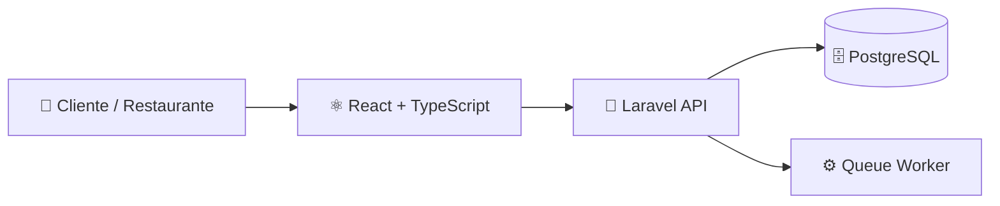

<div align="center">

# 🍽️ Deep Dish

**Fila inteligente. Reservas sem fricção. Restaurantes no controle.**

Plataforma para gerenciamento de **filas, reservas e mesas em restaurantes**.

<br>


</div>

---

## 📌 Sobre

O **Deep Dish** é uma plataforma web para gerenciamento de **filas e reservas em restaurantes**.

Clientes podem entrar em filas remotamente, realizar reservas e acompanhar seu atendimento.

Restaurantes possuem um painel para gerenciamento de **mesas, filas, reservas e funcionários**.

---

## ✨ Funcionalidades

### 👤 Cliente

- 🔎 Busca de restaurantes
- 🎟️ Entrada remota na fila
- 📅 Reserva de mesas
- 📍 Acompanhamento da posição na fila
- ❌ Cancelamento de reservas e filas
- 🔔 Notificações

### 🍽️ Restaurante

- 🪑 Gerenciamento de mesas
- 🎟️ Controle da fila
- 📅 Gerenciamento de reservas
- 👥 Gestão de funcionários
- ⚙️ Configuração do restaurante

---

## 🛠️ Tecnologias

<p align="center">


</p>

### Frontend

`React` `TypeScript` `Vite` `Tailwind CSS` `shadcn/ui`

### Backend

`Laravel` `REST API` `JWT` `Queue Worker`

### Banco de Dados

`PostgreSQL` `Supabase`

### Infraestrutura

`Docker` `Docker Compose`

---

## 🏗️ Arquitetura



---

## 📂 Estrutura

```text
deep-dish/
│
├── deep-dish-frontend/
│   └── src/
│       ├── components/
│       ├── layouts/
│       ├── pages/
│       ├── routes/
│       ├── services/
│       └── types/
│
├── deep-dish-backend/
│
└── docker-compose.yml
```

---

## 🚀 Executando

### Docker

```bash
git clone <YOUR_GIT_URL>

cd deep-dish

cp deep-dish-backend/.env.example deep-dish-backend/.env

docker compose up --build
```

Aplicação disponível em:

```text
Frontend → http://localhost:8080
Backend  → http://localhost:8000
```

### Sem Docker

#### Frontend

```bash
cd deep-dish-frontend
npm install
npm run dev
```

#### Backend

```bash
cd deep-dish-backend
composer install
cp .env.example .env
php artisan serve
```

#### Queue Worker

```bash
php artisan queue:work
```

---

## 📈 Roadmap

- [x] Sistema de filas
- [x] Sistema de reservas
- [x] Gerenciamento de mesas
- [x] Autenticação JWT
- [x] Gestão de funcionários
- [x] Docker Compose
- [x] Worker de e-mails
- [ ] WebSockets
- [ ] Notificações push
- [ ] Analytics
- [ ] Pagamentos

---

## 👥 Time

| Integrante | Função |
|---|---|
| Brenda Regis Batista Bandeira | Requisitos / UX |
| Eduardo Gondim Marinho | Requisitos / UX |
| Eduardo Serra Pierre Vidal | Full Stack |
| João Guilherme Costa Pereira | Full Stack / Scrum Master |
| João Pedro Vieira de Oliveira | Full Stack |
| **Arthur Cavalcante Neves** | **Full Stack / UI-UX** |

---

## 🔗 Links

🎨 [Pitch Deck — Canva](https://www.canva.com/design/DAHDZnOSuv4/Id21tAfjwMEOS-4B5mpf_w/edit)

---

<div align="center">

### 🍽️ Deep Dish

**Tecnologia para tornar a experiência entre clientes e restaurantes mais simples.**

</div>
